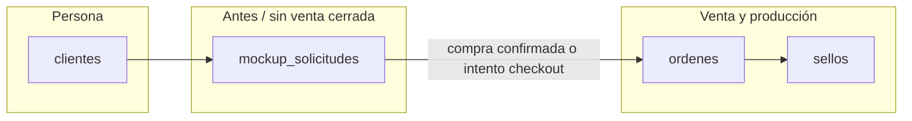
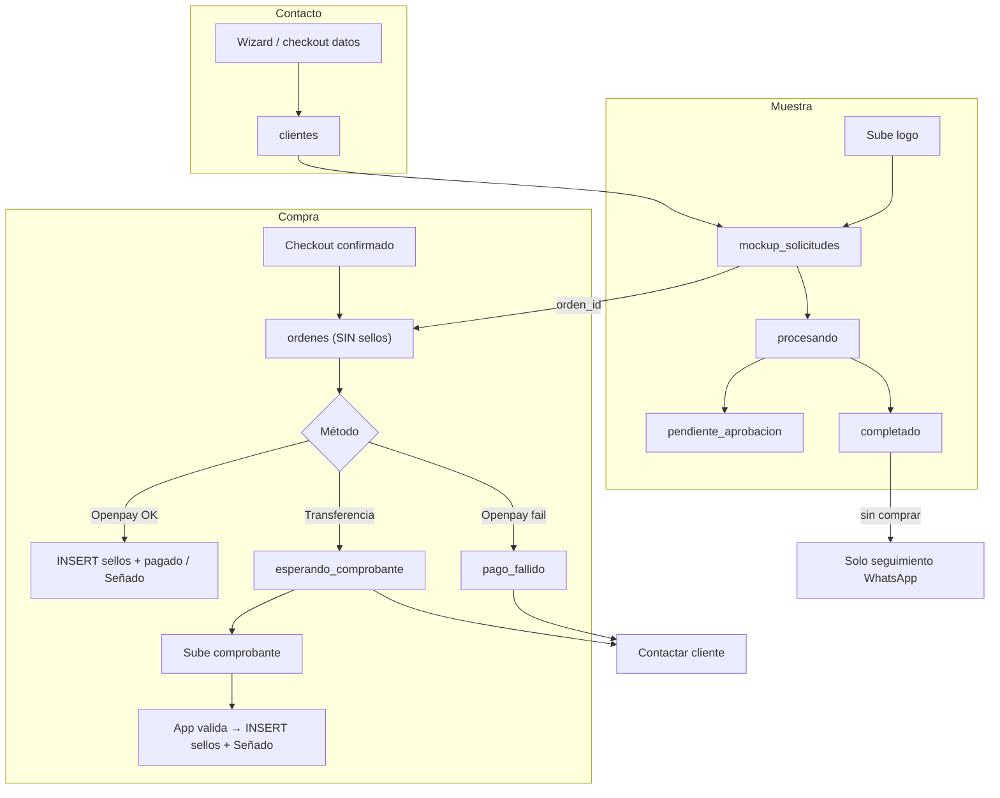

# Modelo de datos: Web Alcohn ↔ Supabase (app compartida)

Documento de referencia para conectar la tienda web con el **mismo proyecto Supabase** que usa la app interna. Resume decisiones de arquitectura, tablas, flujos y campos sugeridos.

> **Estado:** alineado con las reglas que la app interna definió en [`web-alcohn-integracion.md`](../web-alcohn-integracion.md). La migración [`docs/sql/001_web_alcohn_integration.sql`](sql/001_web_alcohn_integration.sql) ya está aplicada en producción.

## Regla maestra — Opción A

La web crea **`ordenes` al confirmar el checkout** pero **NO inserta `sellos` hasta que el pago esté confirmado**. La app interna oculta automáticamente cualquier `ordenes` con `origen='Web'` y `estado_pago_web != 'pagado'`, así que el equipo solo ve ventas reales en Pedidos y Producción.

Esto evita que pedidos no pagados muevan stock, costos o tableros operativos por culpa de los triggers de `sellos`.

---

## 1. Proyecto Supabase

| Decisión | Detalle |
|----------|---------|
| **Un solo proyecto** | Mismo Supabase que la app → las ventas y los intentos aparecen donde el equipo ya trabaja. |
| **Escritura desde la web** | Siempre vía **API routes de Next.js** con `SUPABASE_SERVICE_ROLE_KEY` (nunca crear pedidos sensibles desde el navegador con anon key). |
| **Variables de entorno** | `NEXT_PUBLIC_SUPABASE_URL`, `SUPABASE_SERVICE_ROLE_KEY` (servidor). |

El catálogo (diseños estándar, FAQs, páginas) sigue en código (`/src/data`). Supabase es para **personas, muestras, pedidos, archivos y pagos**.

---

## 2. Tablas y responsabilidades

| Tabla | Rol |
|-------|-----|
| **`clientes`** | Cualquier persona que dejó datos de contacto (web, WhatsApp, etc.). Incluye quien **no compró**. |
| **`mockup_solicitudes`** | Cada intento de **muestra / wizard** (logo, mockups, revisión). La compra puede ser días después o nunca. |
| **`ordenes`** | Cabecera del pedido cuando hay **intento o confirmación de compra** (checkout). |
| **`sellos`** | Ítems del pedido (en el esquema actual no hay `order_items`; cada línea es un sello). |
| **`direcciones`** | Envío, cuando el checkout lo complete. |
| **Storage** | Logos, mockups, comprobantes de transferencia. |

### Qué NO hacer

- **No** usar columna `compro` en `clientes` → se desactualiza. Mejor: “compró” = tiene `ordenes` relevantes o `mockup.orden_id` completado.
- **No** tabla `leads` separada al inicio (salvo CRM de marketing más adelante).
- **No** crear `ordenes` + `sellos` solo por navegar o por tener mockup listo **sin** pasar por checkout (evita ruido y triggers de fabricación).
- **No** duplicar el wizard en otra tabla; `mockup_solicitudes` ya modela la muestra.

---

## 3. Cuándo crear cada registro

| Momento | Acción |
|---------|--------|
| Solo navega la web | Nada en BD |
| Completa **contacto** del wizard o checkout | **Upsert `clientes`** (`medio_contacto = 'Web'`, upsert por `telefono` normalizado) |
| Sube logo / inicia muestra | **INSERT `mockup_solicitudes`** (`origen='web'`, `estado='procesando'`, `nombre_slug` obligatorio) |
| Mockup listo o en revisión | **UPDATE mockup** → `completado` o `pendiente_aprobacion` |
| Confirma datos en **checkout** | **INSERT `ordenes`** (`origen='Web'`, `estado_pago_web` seteado, `estado_orden` NULL). **NO insertar `sellos` todavía.** Enlazar `ordenes.mockup_solicitud_id` y `mockup_solicitudes.orden_id`. |
| Pago tarjeta OK | **INSERT `sellos`** + UPDATE orden → `estado_pago_web='pagado'` y `estado_orden='Señado'` |
| Pago tarjeta falla | UPDATE orden → `estado_pago_web='pago_fallido'` + `pago_error_codigo` + `pago_error_mensaje` |
| Elige **transferencia** | Orden con `estado_pago_web='esperando_comprobante'` |
| Sube comprobante | Bucket `comprobantes` + columnas `comprobante_*` en la orden |
| App valida transferencia | **INSERT `sellos`** + UPDATE orden → `estado_pago_web='pagado'` y `estado_orden='Señado'` |

### Mapeo web → `clientes`

- `clientes` exige `nombre`, `apellido`, `telefono`.
- Partir el nombre del formulario o usar apellido placeholder si hace falta.
- `mail`: solo si lo escribió; usar `NULL` (no `""`) por UNIQUE.
- `medio_contacto`: valor permitido `'Web'`.

---

## 4. Embudo: wizard → compra (opcional)

El wizard de personalizados y la compra son **dos tiempos**:

1. **Muestra** (wizard completo, mockup, precio).
2. **Compra** (carrito + checkout + pago), puede no ocurrir.

### Quien hizo muestra y no compró

- `clientes` + `mockup_solicitudes` con mockup terminado.
- `mockup_solicitudes.orden_id` **NULL**.
- Lista para seguimiento por WhatsApp (remarketing).

### Quien intentó comprar y no cerró

- `ordenes` con `estado_pago_web` pendiente / fallido / esperando comprobante.
- Opcional: `checkout_iniciado_at`, `carrito_json` en la orden o en el mockup enlazado.

### Mismo cliente, varias veces

- Un `clientes` (mismo teléfono).
- Varias `mockup_solicitudes` (un logo distinto por intento).
- Cero o varias `ordenes` en el tiempo.

---

## 5. Revisión de diseño: ¿dónde guardar?

| Situación | Dónde |
|-----------|--------|
| **Antes de pagar** (logo complejo, muestra manual) | `mockup_solicitudes` → `pendiente_aprobacion` → `completado`. **No** `ordenes`/`sellos` todavía. |
| **Después de pagar** (retoque, vector, verificar) | `ordenes` + `sellos` (`nota`, `archivo_base`, `estado_fabricacion`, `estado_vectorizacion`). |

`mockup_solicitudes` es el pipeline que la app ya usa para generar mockups. La web debería alimentar la misma tabla.

---

## 6. Errores de compra (tarjeta / Openpay)

**Objetivo:** registrar el intento para escribir por WhatsApp y retomar la venta.

### Flujo recomendado (Opción A)

1. Usuario confirma checkout → crear **`cliente` + `orden` (sin `sellos`)** con `estado_pago_web='pendiente'`.
2. Generar `web_checkout_ref` (token opaco) y guardarlo en la orden; usarlo en las URLs de Openpay para retomar.
3. Redirige a Openpay.
4. **Success** (`/checkout/openpay/success`) → API **inserta los `sellos`** y marca la orden: `estado_pago_web='pagado'`, `estado_orden='Señado'`, `pago_confirmado_at=now()`.
5. **Failed** (`/checkout/openpay/failed`) → API actualiza la misma orden: `estado_pago_web='pago_fallido'` + `pago_error_codigo` + `pago_error_mensaje` + `ultimo_intento_pago_at`.

La orden debe identificarse por `orden_id` o `web_checkout_ref` en la URL o sesión, **no** depender solo del carrito en `localStorage`.

### Campos sugeridos en `ordenes`

| Campo | Uso |
|-------|-----|
| `origen` | `'Web'` |
| `metodo_pago` | `'Openpay'` \| `'Transferencia'` |
| `estado_pago_web` | Ver sección 8 |
| `pago_error_codigo` / `pago_error_mensaje` | Detalle del fallo |
| `openpay_order_id` | Referencia externa |
| `ultimo_intento_pago_at` | Timestamp |

---

## 7. Pago por transferencia y comprobante

**Objetivo:** quedar registrado desde que confirman el pedido; el comprobante es obligatorio para validar.

### Flujo (Opción A)

1. Elige transferencia y confirma → **solo** `ordenes` con `metodo_pago='Transferencia'` y `estado_pago_web='esperando_comprobante'`. **Sin `sellos`.**
2. Cliente sube archivo → **Storage** (bucket `comprobantes`, ruta `{orden_id}/{timestamp}.ext`) + `comprobante_path` / `comprobante_url` + `comprobante_subido_at` en la orden.
3. Equipo valida en la app → **inserta los `sellos`** y pasa la orden a `estado_pago_web='pagado'` + `estado_orden='Señado'`.

Si solo mandan WhatsApp sin archivo, la orden sigue en `esperando_comprobante` y se puede pedir el comprobante.

### Campos sugeridos

| Campo | Uso |
|-------|-----|
| `comprobante_path` o `comprobante_url` | Archivo subido |
| `comprobante_subido_at` | Cuándo lo subió |
| `comprobante_validado_por` / `comprobante_validado_at` | Opcional, validación interna |

---

## 8. Estados de pago web (`estado_pago_web`)

Propuesta de valores **separados** de `estado_orden` / envío (para no romper la lógica actual de producción):

| Valor | Significado |
|-------|-------------|
| `pendiente` | Checkout creado, aún no pagó |
| `pago_fallido` | Openpay o error de red; contactar por WhatsApp |
| `esperando_comprobante` | Transferencia elegida; falta o hay que validar comprobante |
| `pagado` | Pago confirmado (tarjeta o transferencia validada) |
| `abandonado` | Opcional: timeout sin actividad |

`estado_orden` sigue siendo el estado operativo de la app (`Señado`, `Hecho`, envíos, etc.) una vez el pago está confirmado.

---

## 9. Extensiones sugeridas en BD

### `mockup_solicitudes`

| Columna | Tipo | Notas |
|---------|------|--------|
| `cliente_id` | uuid FK → `clientes` | Quién es |
| `orden_id` | uuid FK → `ordenes`, nullable | Se completa al comprar |
| `checkout_iniciado_at` | timestamptz, nullable | Llegó al checkout |
| `carrito_json` | jsonb, nullable | Snapshot si abandona checkout |
| `origen` | text | `'web'` |

Estados actuales: `procesando`, `pendiente_aprobacion`, `completado`, `error`. Valor extra opcional: `listo_para_comprar` si hace falta distinguir en la UI.

### `ordenes`

| Columna | Tipo | Notas |
|---------|------|--------|
| `origen` | varchar | `'Web'` |
| `metodo_pago` | varchar | `Openpay`, `Transferencia` |
| `estado_pago_web` | varchar | Ver sección 8 |
| `pago_error_*`, `openpay_order_id` | text | Errores tarjeta |
| `comprobante_*` | text / timestamptz | Transferencia |
| `notas_web` | jsonb | Metadata libre |

### `sellos`

Usar **`item_config` (jsonb)** para metadata web sin muchas migraciones:

- `design_slug`, `material_web`, `origen`, URLs del wizard, id de `mockup_solicitud`, etc.

Copiar URLs relevantes a `archivo_base` / `diseno` cuando corresponda.

### Storage (mismo proyecto)

| Bucket | Contenido |
|--------|-----------|
| `logos-web` | Logo original / optimizado del wizard |
| `mockups-web` | Vistas previas / mockups generados |
| `comprobantes` | Comprobantes de transferencia (`{orden_id}/{timestamp}.ext`) |

Los buckets de la app interna (`base`, `vector`, `foto`, etc.) **no se tocan desde la web**. Subir siempre desde API routes con `SUPABASE_SERVICE_ROLE_KEY`.

---

## 10. Vistas útiles en la app

| Vista | Filtro aproximado |
|-------|-------------------|
| **Muestra sin compra** | `mockup.estado IN ('completado','pendiente_aprobacion')` AND `orden_id IS NULL` |
| **Pagos fallidos** | `origen = 'Web'` AND `estado_pago_web = 'pago_fallido'` |
| **Esperando comprobante** | `metodo_pago = 'Transferencia'` AND `estado_pago_web = 'esperando_comprobante'` |
| **Comprobante recién subido** | `comprobante_subido_at` reciente |

Acción típica: botón “WhatsApp” usando `clientes.telefono`.

---

## 11. Reglas operativas con la app interna

Estas reglas vienen de [`web-alcohn-integracion.md`](../web-alcohn-integracion.md). Son **obligatorias** para no romper Pedidos / Producción.

| Regla | Detalle |
|-------|---------|
| **Opción A** | Sellos **solo al confirmar el pago** (tarjeta OK o transferencia validada). |
| **Filtro app interna** | Ya oculta `origen='Web' AND estado_pago_web != 'pagado'`. Confiar en eso, no insertar sellos como "draft". |
| **No webhook `pedido_registrado`** | No disparar `webhook-bot` desde la web. Lo dispara la app al validar pago. Si hace falta aviso desde la web, coordinar un `tipo_actualizacion` nuevo. |
| **Totales automáticos** | `valor_total`, `senia_total`, `restante`, `cantidad_sellos` los recalcula un trigger desde `sellos`. **No setear a mano.** |
| **Unidades** | `largo_real` / `ancho_real` en `sellos` van en **cm** (no mm). |
| **Defaults al crear sello** | `estado_fabricacion='Sin Hacer'`, `estado_venta='Señado'`, `item_type` correcto (`SELLO`, `ABECEDARIO`, etc.), `valor`, `orden_id`. |
| **Mockups con materiales nuevos** | `ceramica`/`alimentos`/`otros` se aceptan pero la app no genera vistas previas auto para esos. Está OK. |
| **Servicio role** | Toda escritura sensible desde API routes con `SUPABASE_SERVICE_ROLE_KEY`. Nunca anon key en el cliente. |

---

## 12. Diagrama completo

---

## 13. Implementación en la web (checklist)

- [ ] Dependencia `@supabase/supabase-js` + cliente admin en servidor (`lib/supabase/server.ts`).
- [ ] Variables `NEXT_PUBLIC_SUPABASE_URL` y `SUPABASE_SERVICE_ROLE_KEY` en `.env.local` y Vercel.
- [ ] `POST /api/clientes/upsert` — al pasar ContactStep o checkout paso 1. Normaliza teléfono, parte nombre/apellido, `medio_contacto='Web'`, `mail` NULL si vacío.
- [ ] `POST /api/mockups` — crear/actualizar `mockup_solicitudes` con `origen='web'` y `nombre_slug`.
- [ ] Subir logos del wizard a bucket `logos-web` y reflejar paths en la solicitud.
- [ ] `POST /api/checkout/intent` — crear **solo** `ordenes` (sin sellos) con `origen='Web'`, `estado_pago_web` y `web_checkout_ref`. Enlazar con `mockup_solicitudes`.
- [ ] Callback Openpay success → `PATCH /api/orders/:id/pago` → **insertar `sellos`** y marcar pagado/Señado.
- [ ] Callback Openpay failed → `PATCH /api/orders/:id/pago` → `pago_fallido` + error.
- [ ] `POST /api/orders/:id/comprobante` — subir comprobante a `comprobantes/{orden_id}/...` y reflejar en la orden (sigue sin sellos hasta validar).
- [ ] **No** disparar webhook `pedido_registrado` desde la web.
- [ ] Páginas Openpay success/failed pasan `orden_id` o `web_checkout_ref` por URL.
- [ ] Smoke test del flujo completo y verificar en la app interna que el pedido aparece **solo** al pagar.

---

## 14. Referencia de esquema actual

- Definiciones SQL de tablas existentes: [`supabase_schema.md`](../supabase_schema.md).
- Migración aplicada: [`docs/sql/001_web_alcohn_integration.sql`](sql/001_web_alcohn_integration.sql).
- Reglas de la app interna: [`web-alcohn-integracion.md`](../web-alcohn-integracion.md).

---

## 15. Resumen en una frase

**`clientes`** guarda a todos los contactos; **`mockup_solicitudes`** guarda cada muestra del wizard (compre o no); **`ordenes`** se crea al confirmar el checkout pero **los `sellos` se insertan recién cuando el pago se confirma** (tarjeta OK o transferencia validada). La app interna oculta los pedidos web no pagados, así que solo ve ventas reales.
